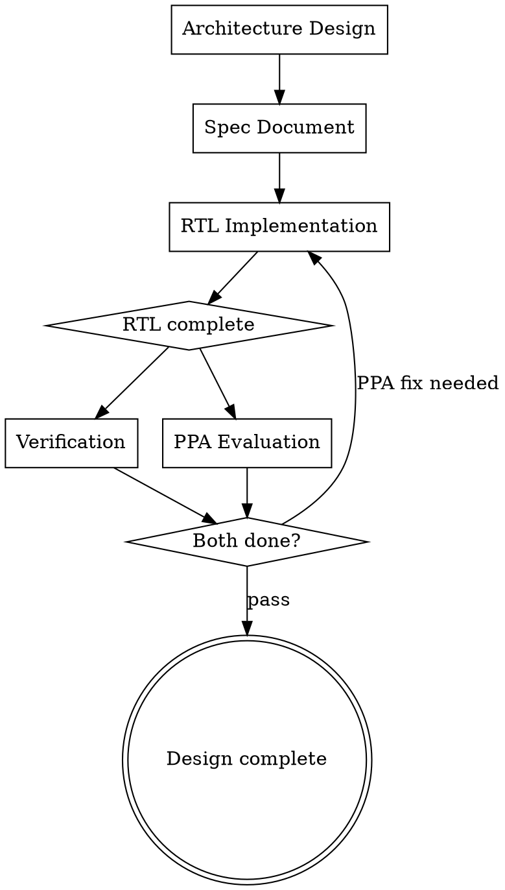

# Chip Design Workflow

## Overview

This skill defines the **mandatory workflow** for RTL IP/module design. You MUST follow these phases in order. Each phase has entry/exit criteria — do not skip ahead.

When you receive an RTL design task, use this workflow to determine **which phase you are in** and **what you must complete before moving to the next phase**.

## Standard RTL Design Phases

A complete IP/module design from scratch typically goes through these phases:

## Phase Definitions

### Architecture Design

**What it covers**: Interface definition, module partitioning, clock domain planning, reset strategy, parameter strategy, data-path and control-path structure.

**Entry**: User has stated what IP/module to build.
**Exit**: Architecture decisions documented; interfaces and sub-module breakdown agreed with user.

**Related skills**: `design-microarch`, `brainstorming`

---

### Spec Document

**What it covers**: Functional description, interface table, timing diagrams (if needed), parameter table, register map (if applicable), design constraints and assumptions.

**Entry**: Architecture agreed.
**Exit**: Spec document written, reviewed, and confirmed by user.

**Related skills**: spec-reviewer agent

---

### RTL Implementation

**What it covers**: RTL coding in synthesizable SystemVerilog, filelist creation, lint checks, coding style compliance.

**Entry**: Spec confirmed.
**Exit**: All RTL files written, filelist complete, lint-clean, coding style reviewed.

**Related skills**: `rtl-coding-style`, `svlinter`, `fexpand`, rtl-reviewer agent

---

### Verification (parallel with PPA)

**What it covers**: Testplan creation, testbench construction, testcase development, simulation, regression, coverage closure.

**Entry**: Lint-clean RTL available.
**Exit**: All planned testcases passing; coverage targets met.

**Related skills**: `verification-testplan`, `verification-env`, `simforge`, `wave-reader`, `cov-reader`

---

### PPA Evaluation (parallel with Verification)

**What it covers**: Quick synthesis, gate count check, critical path analysis, logic depth evaluation. If PPA results are unacceptable, RTL needs modification and both verification and PPA re-run.

**Entry**: Synthesizable RTL available.
**Exit**: PPA within acceptable range, or RTL corrected and re-evaluated.

**Related skills**: `fast-elaborator`, `floorplan-guide`

## Phase Transition Criteria

| Transition | Condition |
|---|---|
| Architecture → Spec | Architecture decisions agreed with user |
| Spec → RTL | Spec document confirmed by user |
| RTL → Verification + PPA | RTL lint-clean, coding style reviewed |
| Verification + PPA → Done | Verification passing AND PPA acceptable |
| PPA → RTL (loop) | PPA unacceptable, RTL needs modification |

## Typical Risks of Skipping Phases

| Skipped phase | Typical consequence |
|---|---|
| Architecture | Repeated rewrites, interface churn |
| Spec | Verification has no reference; ambiguities surface late |
| PPA evaluation | Late timing/area surprise forces RTL rewrite after verification is done |
| Verification | Optimizing for PPA on functionally broken RTL |
