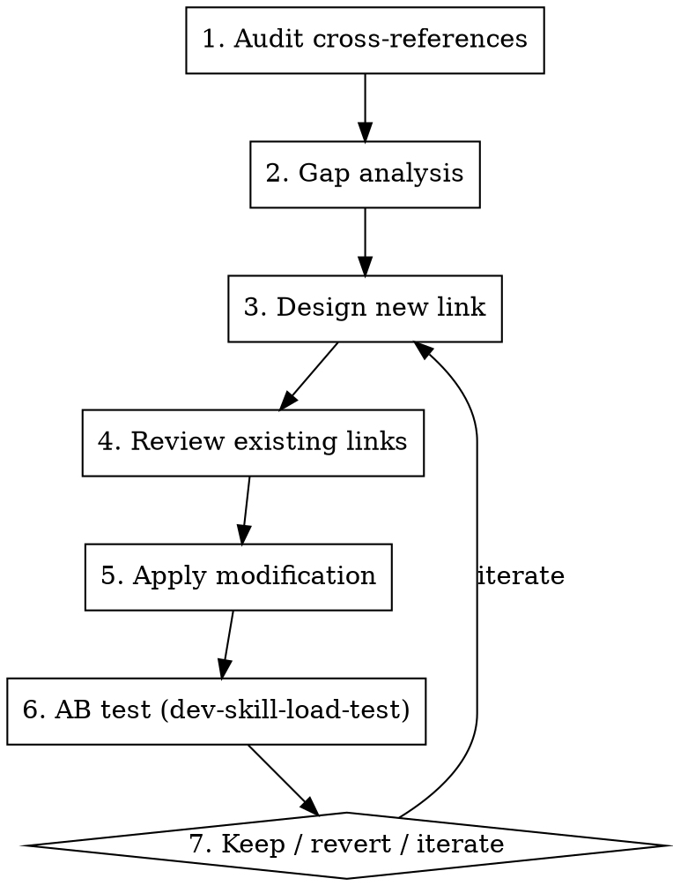

# dev-skill-index

Analyze and manage the cross-reference graph between skills so that the right skills get loaded at the right time.

**Core insight**: A skill's own description has limited power to drive its loading (~26% ceiling on sub-glm5). The dominant factor is whether **upstream flow skills** (like `brainstorming`) explicitly name it in a numbered checklist step. This skill provides the methodology to find and fix missing links.

## When to Use

- A target skill has low load rate despite a relevant description
- You need to audit the full skill cross-reference topology
- You're adding a new skill and need to decide which existing skills should reference it
- You're reviewing whether a skill's incoming/outgoing references are adequate
- You want to understand why agents don't load a particular skill

## Workflow



## Step 1 — Audit Cross-References

Read every SKILL.md and extract all skill-to-skill references into a table:

| Column | Description |
|---|---|
| Source | Skill containing the reference |
| Target | Skill being referenced |
| Strength | **strong** = "REQUIRED"/"MUST load"/"load X" in checklist; **medium** = "Related skills"/"Consult X"; **weak** = mentioned in passing, examples, "Called by" |
| Conditional | Gated on a condition? (e.g., "if RTL task -> load X") |
| Exact Quote | Verbatim reference text |

Then compute topology metrics per skill:

| Metric | Definition |
|---|---|
| Out-degree | Number of outgoing references |
| In-degree | Number of incoming references |
| Strong-in | Incoming **strong** references (most impactful) |

Classify each skill:

| Type | Criteria | Implication |
|---|---|---|
| **Hub** | in-degree >= 3 | Likely loaded via multiple paths |
| **Leaf** | out-degree = 0 | Never triggers other skill loads |
| **Orphan** | in = 0 AND out = 0 | Completely disconnected |
| **Bridge** | Connects two clusters | Critical for cross-cluster loading |

## Step 2 — Gap Analysis

For a target skill with low load rate, evaluate every other skill as a potential source:

**Evaluation criteria** (score each 0-10):

1. **Workflow adjacency** — Does the source skill's flow naturally precede or include the target's domain? (e.g., brainstorming precedes all design phases)
2. **Domain overlap** — Do both skills operate in the same domain?
3. **User scenario frequency** — How often does a user triggering the source also need the target?
4. **Existing indirect path** — Is there already a chain A -> B -> target? If so, is it reliable (all strong links)?

**Necessity** = max(adjacency, overlap) weighted by frequency

**Priority** = Necessity x source_load_rate (a high-necessity link from a rarely-loaded source has low priority)

Sort all candidate sources by priority. Focus on top 3.

## Step 3 — Design New Link

### Placement (ordered by effectiveness)

| Placement | Expected Compliance | When to Use |
|---|---|---|
| Numbered checklist step, explicit name | **~80%+** | Target should ALWAYS load with source |
| Conditional in checklist ("if X -> load Y") | **~60-70%** | Target is domain-specific |
| "Related skills" section | **~5-10%** | Documentation only; do NOT rely on this for loading |
| "Integration" / "Called by" section | **~0-5%** | Pure documentation |

### Strength markers

| Marker | Example Text | Compliance |
|---|---|---|
| REQUIRED | "**REQUIRED**: Load `target`" | ~80%+ |
| MUST | "you MUST also load `target`" | ~70%+ |
| Imperative | "Load `target` for..." | ~50-60% |
| Suggestive | "Also consider `target`" | ~20-30% |
| Informational | "Related skills: `target`" | ~5-10% |

### Link text rules

1. **Name the skill explicitly** — backtick-quoted exact name
2. **Use an action verb** — "load", not "consider" or "see"
3. **Give a reason** — agents comply more when they understand why
4. **Place where attention is** — in a numbered step the agent is executing, not a reference section

**Template**:
```markdown
- [domain condition] -> load `target-skill` for [what it provides]
```

**Anti-patterns**:
- "See `target-skill` for more information" — too passive, agents skip
- "Related skills: `target-skill`" — treated as metadata, not instruction
- "Load all relevant skills" without naming them — agents don't know what "relevant" means

## Step 4 — Review Existing Links

Before applying, check for problems:

**From the source skill:**
1. **Redundancy** — Does the new link duplicate an existing reference? Consolidate.
2. **Ordering** — Is it early enough? Earlier in checklist = more likely executed.
3. **Completeness** — With this link added, are there still missing links?
4. **Overload** — Does the source now reference >6 targets in one step? If so, group by condition.

**To the target skill:**
1. **Coverage** — Which other source skills should also reference the target?
2. **Consistency** — Are all incoming references using similar strength?
3. **Circular dependency** — Does the new link create a loop that could cause infinite loading?

## Step 5 — Apply Modification

1. Edit the source SKILL.md with the drafted link text
2. Update the cross-reference audit table (if maintained)
3. Proceed to AB test

## Step 6 — AB Test

Use `dev-skill-load-test` to verify the modification works. Key parameters:

| Parameter | Value |
|---|---|
| Model | Weakest available (e.g., sub-glm5) |
| N per group | >= 20 |
| Baseline | Same prompts, before modification |
| Probe | Resume session + ask directly |

**Decision matrix**:

| Lift | Action |
|---|---|
| >= +30% | Keep |
| +10% to +29% | Keep, consider strengthening |
| -10% to +9% | Revert |
| <= -10% | Revert immediately |

Check side effects: did other skills' load rates change? Did source skill load less?

## Step 7 — Iterate

If lift is insufficient, diagnose from probe responses:

| Failure Mode | Fix |
|---|---|
| Agent loaded source but skipped the checklist step | Move link earlier in checklist |
| Agent read step but rationalized skipping | Add REQUIRED/MUST marker |
| Agent was already past the relevant step | Find a different source skill |
| Link text too generic | Be more specific about skill name and reason |

---

## Empirical Findings (from 140+ tests, 7 rounds)

These findings are the foundation of this methodology. They are not theoretical — each was validated by controlled AB testing on sub-glm5.

1. **Description ceiling ~26%** — No matter how you rewrite a target skill's own description, if it's not referenced by upstream flow skills, max load rate is ~26%.

2. **Upstream leverage is dominant** — Adding a target to a high-traffic skill's checklist (e.g., brainstorming) can lift load rate from ~15% to ~80%+. This is 3-5x more effective than description changes.

3. **"Related skills" sections are decorative** — Agents almost never act on "Related skills:" tables. Use them for documentation, not for driving loading.

4. **Generic "load all relevant skills" fails** — Even with CRITICAL markers, if no specific skill names are given, agents don't know what to load. Proven in G group (15% with generic CRITICAL note vs. 80%+ with named skills).

5. **Explicit > Implicit** — Named skills in numbered checklist steps work. Everything else is unreliable.

6. **BM coverage effect** — Once an agent enters a flow skill (e.g., brainstorming), it stops scanning the skill list for independent matches. The flow skill's internal references become the only path to loading additional skills.

7. **Loading order matters** — A target skill that should load alongside a flow skill must be referenced early in that flow skill's checklist. Later references have lower compliance.

## Common Mistakes

| Mistake | Why it's wrong | Fix |
|---|---|---|
| Improving target's description to fix low load rate | Description ceiling ~26%; upstream links dominate | Add reference from upstream flow skill |
| Using "Related skills" to drive loading | ~5-10% compliance | Use numbered checklist step with explicit "load" |
| Adding generic "load relevant skills" note | Agents don't know which skills are "relevant" | Name specific skills |
| Changing multiple skills between A and B test | Can't attribute causation | One variable per test |
| Skipping AB test after adding link | No evidence it works | Always test with `dev-skill-load-test` |
| Assuming strong model results apply to weak models | Weak models have lower compliance | Test on weakest model first |
