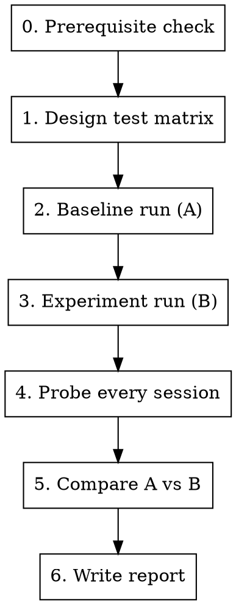

# dev-skill-load-test

Batch-test whether a target skill is actually loaded by subagents under realistic task prompts.

**Core insight**: Subagents often load a skill without explicitly saying so. If AGENTS.md enforces skill call logs, read the log directly from the task output. Otherwise, resume the session and ask.

**Cost insight**: Each subagent session that runs to completion (full design, full implementation) wastes tokens and time. The test only needs the agent to reach the skill-loading decision point — not to finish the task.

## Workflow



### Step 0 — Prerequisite check

Before any test, verify the target skill is visible to the system:

```
Ask a subagent: "List every skill name you can see in available_skills."
```

If the skill is missing, **stop** — no amount of testing will work. New skills require a session restart to appear in `available_skills`.

### Step 1 — Design test matrix

Pick **N task prompts** (recommend N >= 10) that should trigger the target skill.

**Guidelines**:
- Cover a range of difficulty / specificity (simple, medium, complex, edge-case).
- Each prompt should be a natural user request, not a meta-instruction about skills.
- Define `expected_skills`: the skill name(s) the agent should load for each prompt.
- **Add an early-stop constraint** to every prompt (see below) — do not let agents run to completion.

**Early-stop constraint**

The skill-loading decision happens in the first 1-2 replies (brainstorming phase). Everything after that (design, implementation, verification) is irrelevant to the test and wastes tokens. Append a stopping condition to every prompt:

```
在提出第一个澄清问题后停下来，等待用户回复。不要继续执行后续步骤。
```

Or in English:

```
Stop after asking your first clarifying question. Do not proceed further until the user replies.
```

This ensures the agent loads all relevant skills (which happens before or during the first reply), then halts — giving you a clean observable result without running the full task.

**Example** (target skill = `rtl-coding-style`):

| # | prompt | expected_skills |
|---|--------|-----------------|
| 1 | "Design a sync FIFO. Stop after asking your first clarifying question." | rtl-coding-style, design-microarch |
| 2 | "Design an edge detector. Stop after asking your first clarifying question." | rtl-coding-style, design-microarch |
| … | … | … |

### Step 2 — Baseline run (A group)

Run N prompts **without** the modification you want to test (original skill version, or target skill absent).

Launch all N prompts in parallel in a single message (up to 100 concurrent task() calls). Collect all task_ids before proceeding.

**Important**: Do NOT ask about skills in the task prompt — let the agent behave naturally.

### Step 3 — Experiment run (B group)

Apply the modification (e.g., new skill version, changed description, added flow step), then repeat the same N prompts.

### Step 4 — Collect skill call logs

**If AGENTS.md enforces skill call logs (RULE #2):**

Each task output already contains a `--- skill call log ---` block at the end. Read it directly — no probe needed. Extract the cumulative list and check whether the target skill appears.

```
累计调用:
  #1. brainstorming
  #2. rtl-coding-style
  #3. design-microarch
  ← design-workflow missing → FAIL
```

The log also reveals **call order**, which is critical for diagnosing *why* a skill was missed (e.g., brainstorming loaded in the same batch as other skills, so its instructions arrived too late to influence that batch).

**If skill call logs are not available:**

Resume each session and ask directly:

```
task(
  task_id = "<session_id>",
  prompt  = "请直接回答，不要执行任何操作：\n1. 你加载了哪些skill？列出完整名称。\n2. 是否加载了 <target_skill>？\n3. 如果没有，为什么？"
)
```

**Why resume instead of a new session**: The agent retains its tool-call history. It can truthfully report what it loaded. A new session has no memory.

Probe all sessions in parallel in a single message, same as execution.

### Step 5 — Compare A vs B

Fill in the comparison table:

```markdown
| # | prompt | A: loaded? | B: loaded? |
|---|--------|-----------|-----------|
| 1 | … | no | yes |
| 2 | … | no | yes |
```

Compute:
```
load_rate(group) = count(loaded) / N
lift = load_rate(B) - load_rate(A)
```

### Step 6 — Write report

Save to `test_results/skill_load_test_<skill_name>_<date>.md`:

```markdown
# Skill Load Test: <target_skill>

**Date**: …  **Cases**: N

## Modification tested
<one-sentence description of what changed between A and B>

## Results
| Metric | A (baseline) | B (experiment) |
|--------|-------------|----------------|
| Load rate | X% | Y% |
| Lift | — | +Z% |

## Per-case detail
| # | prompt | A | B |
…

## Conclusion
…
```

## Lessons learned (from 74 real tests)

These are **general principles**, not specific to any one skill:

1. **Visibility is prerequisite** — If a newly created skill is not in `available_skills`, load rate is always 0%. The system reads the skill list at startup; a session restart is required after adding skills.

2. **Passive observation underestimates load rate** — In one 20-case batch, only 60% of agents explicitly mentioned the loaded skill. After probing, actual load rate was 100%. Always probe.

3. **Description wording matters, but only when visible** — Changing a skill description from passive ("coding style guide") to imperative ("CRITICAL: Load immediately for ANY RTL task") had zero effect when the skill wasn't in `available_skills`, but worked once visible.

4. **LLMs are process-oriented** — Agents decide to load skills based on "what am I doing right now?" not "what domain is this task in?". A skill positioned as "design-phase guidance" loads earlier than one positioned as "coding-phase rules".

5. **Upstream flow skills have leverage** — Modifying a flow skill (e.g., brainstorming) to include a "load domain skills" step is more effective than relying on the target skill's own description to self-advocate.

6. **One variable at a time** — When multiple changes are applied simultaneously (new skill + modified description + flow change), a positive result doesn't tell you which change mattered. Prefer isolated A/B tests.

## Common mistakes

| Mistake | Why it's wrong | Fix |
|---------|---------------|-----|
| Judge by response text only | Agents load skills silently ~40% of the time | Read skill call log, or probe via resumed session |
| Let agents run to completion | Wastes tokens; skill loading happens in first reply | Add early-stop constraint to every prompt |
| Test 1-2 cases and conclude | Insufficient sample size | Minimum 10, recommend 20 |
| Skip prerequisite check | Invisible skills always show 0% | Verify visibility first |
| Change multiple things between A and B | Can't attribute causation | Isolate one variable |
| Forget to save task_ids | Can't probe later | Record every task_id immediately |
| Run all cases sequentially | Wastes time | Launch all in parallel (up to 100) |